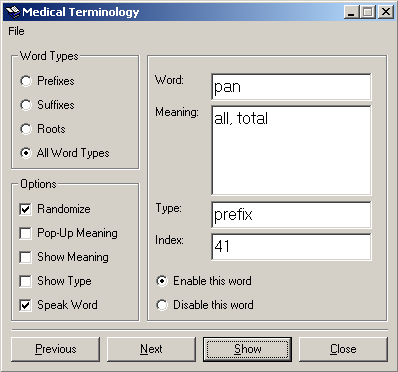



## Medical Terminology

### Description

The words, or terms, which make up the language of medicine are referred to as the terminology of the medical field, or Medical Terminology. This app is a sort-of quizzer that reads aloud (using text-to-speech) to the user over 500 words from a supplied Access database. The user has the option to manually or automatically show the meanings of the words.
 
### More Info
 

             |
---                |---
**Submitted On**   |2003-03-24 11:15:18
**By**             |[Steven Lees](https://github.com/Planet-Source-Code/PSCIndex/blob/master/ByAuthor/steven-lees.md)
**Level**          |Advanced
**User Rating**    |5.0 (35 globes from 7 users)
**Compatibility**  |VB 5\.0, VB 6\.0
**Category**       |[Complete Applications](https://github.com/Planet-Source-Code/PSCIndex/blob/master/ByCategory/complete-applications__1-27.md)
**World**          |[Visual Basic](https://github.com/Planet-Source-Code/PSCIndex/blob/master/ByWorld/visual-basic.md)
**Archive File**   |[Medical\_Te1563843242003\.zip](https://github.com/Planet-Source-Code/steven-lees-medical-terminology__1-44218/archive/master.zip)

